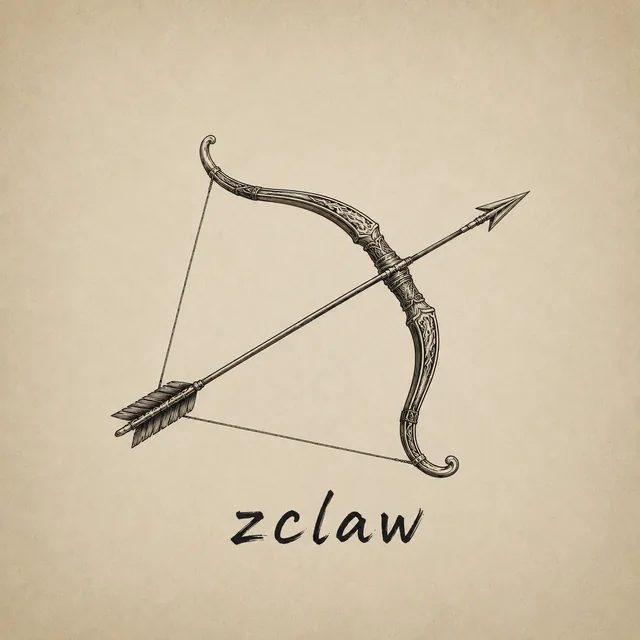

<div align="center">



# Zclaw

**一个面向本地开发工作的 AI 编程助手。**

**Zclaw is a local-first AI coding agent for reading code, editing files, running shell commands, and working with developer tools through an LLM.**

[](https://python.org)
[]()
[](LICENSE)

</div>

---

## Overview

Zclaw 将大语言模型与本地开发环境连接起来，让模型可以在你的授权下读取项目、搜索代码、编辑文件、执行命令、查看 Git 状态、调用 MCP 工具，并通过分层记忆保留必要上下文。

它的设计目标是提供一个可审计、可扩展、适合个人开发环境的 Claude Code / OpenClaw 风格助手。

## Features

- 多模型支持：使用 OpenAI-compatible API，支持阿里百炼、OpenAI-compatible 服务和本地 Ollama。
- 本地工具调用：文件读写、搜索、grep/glob、shell、diff、Git、AST 代码分析。
- 权限与安全：工具危险等级、路径限制、危险命令检测、审计日志。
- 上下文管理：长对话自动压缩，按模型上下文长度控制消息预算。
- 分层记忆：L0-L4 记忆架构，支持会话归档、偏好和项目状态。
- MCP 集成：连接外部 MCP server 并注册为 Agent 工具。
- Skills 扩展：从全局或项目 `.agents/skills` 目录加载可复用能力。
- Web UI：FastAPI + WebSocket 的浏览器界面。

详细架构见 [ARCHITECTURE.md](ARCHITECTURE.md)。

## Installation

```bash
git clone https://github.com/zhanghuiwan/Zclaw.git
cd Zclaw
python -m pip install -e ".[dev]"
```

安装后会提供两个等价命令：

```bash
zclaw --help
Zclaw --help
```

推荐使用小写 `zclaw`。大写 `Zclaw` 仅作为兼容入口保留。

## Configuration

最小配置只需要一个 API key。你可以使用 `.env`：

```bash
cp .env.example .env
```

```env
ZCLAW_PROVIDER=bailian
ZCLAW_MODEL=qwen-plus
ZCLAW_API_KEY=your_api_key_here
ZCLAW_BASE_URL=https://dashscope.aliyuncs.com/compatible-mode/v1
```

也可以不创建 `.env`，直接使用环境变量：

```bash
export ZCLAW_API_KEY=your_api_key_here
zclaw
```

`.env` 查找顺序：

1. `--env /path/to/.env`
2. 当前工作目录 `.env`
3. 项目内 `.env`
4. `~/.Zclaw/.env`
5. 没有 `.env` 时读取当前环境变量

更多配置示例见 [config.example.yaml](config.example.yaml) 和 [config.mcp.example.json](config.mcp.example.json)。

## Usage

交互模式：

```bash
zclaw
```

单次提示：

```bash
zclaw -p "列出当前目录的文件"
```

源码入口：

```bash
python main.py
python main.py -p "帮我总结这个项目"
```

Web UI：

```bash
python -m src.web.server
# open http://localhost:8080
```

完整 Rich REPL 仍保留为开发入口：

```bash
python -m src.cli.app
```

## CLI Commands

默认入口 `zclaw` 与 `python main.py` 共用同一套简易对话实现，支持：

| Command | Description |
| --- | --- |
| `/help` | 显示帮助 |
| `/clear` | 清空当前对话历史 |
| `/undo` | 撤销上一轮对话 |
| `/info` | 显示当前配置 |
| `/quit`, `/exit` | 退出 |

## Tooling

Zclaw 内置工具覆盖：

- 文件：读取、写入、编辑、多处编辑、按行读取/编辑、diff、snapshot。
- 搜索：目录浏览、文件搜索、grep、glob。
- 系统：shell 命令执行，按参数动态判断 `confirm` 或 `dangerous`。
- Git：diff、commit、log、status、branch、show、blame。
- 代码分析：结构分析、符号查找、符号替换、导入分析。
- 记忆：历史搜索、会话历史、持久记忆更新、偏好设置。

## Safety Notice

Zclaw 可以读取和修改本地文件，也可以执行 shell 命令。请把它当作有能力操作你电脑的开发工具，而不是普通聊天机器人。

- 不要在包含敏感数据的目录中无审查运行。
- 不建议直接在生产机器或生产仓库中启用写入和 shell 工具。
- 执行高风险命令前请仔细检查模型意图和参数。
- 不要提交 `.env`、API key、token、私钥、审计日志或个人记忆数据。
- 本地运行数据目录包括 `.Zclaw/`、`.agents/`、`.claude/`，这些目录默认应保持在 Git 之外。

如果你发现安全问题，请通过 GitHub Issues 联系维护者，并避免公开贴出真实密钥或私人日志。

## Development

安装开发依赖：

```bash
python -m pip install -e ".[dev]"
```

运行检查：

```bash
python -m compileall -q main.py src tests
python -m pytest -q
```

测试不应依赖真实 LLM、真实 MCP 服务、用户本机 `.env` 或个人 skills 目录。

## Project Data

Zclaw 会在运行时创建本地数据：

| Path | Purpose |
| --- | --- |
| `.Zclaw/` | 会话、记忆、审计等项目级运行数据 |
| `.agents/skills/` | 项目级 Skills |
| `~/.agents/skills/` | 全局 Skills |
| `~/.Zclaw/.env` | 可选全局环境配置 |

这些文件通常不应该提交到 Git。

## License

Zclaw is released under the [MIT License](LICENSE).
